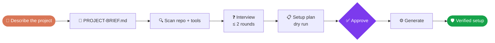
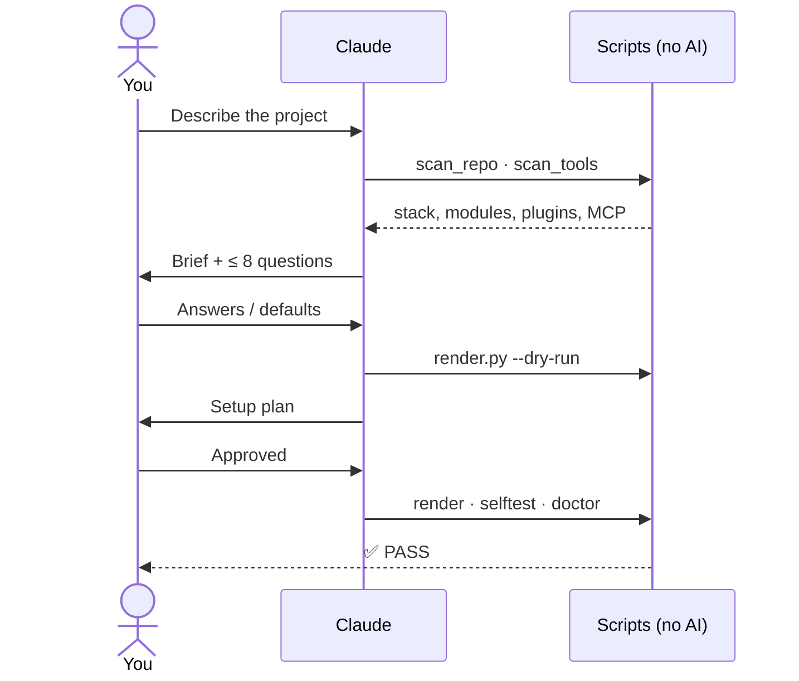
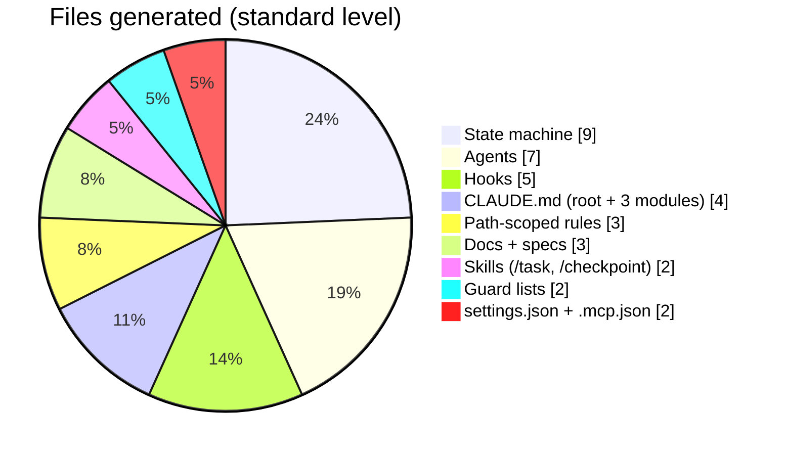

<div align="center">

# Claude Project Setup

**Describe your project. Get a guarded, context-aware Claude Code setup.**
Greenfield or brownfield, from one brief, with nothing written until you approve.

[](CHANGELOG.md)
[](https://code.claude.com/docs/en/plugins)
[](docs/getting-started.md#prerequisites)
[](docs/development.md#conventions)
[](docs/development.md#test-and-validate)
[](docs/troubleshooting.md)
[](https://github.com/sarveshtalele/claude-project-setup/commits/main)

[Quick start](#-quick-start) · [How it works](#-how-it-works) · [What you get](#-what-you-get) · [Docs](#-documentation)

</div>

---



## ✨ Highlights

| | |
|---|---|
| 🧭 **Starts from a chat description** | Say what you want to build, and the plugin drafts the brief and takes it from there |
| 🏗️ **Greenfield and brownfield** | Official scaffolds for new projects; existing source code is never modified |
| 🗂️ **CLAUDE.md that scales** | A root file of ≤ 100 lines, plus a ≤ 40-line file per large module that loads only when needed |
| 🤖 **Project-specific subagents** | 4 core agents plus specialists, filled in with your real commands and paths; add your own with `create-agent` |
| 💸 **Model optimisation you control** | One editable file sets each agent's model, effort and turn limit (economy / balanced / quality), and an uncertain agent is retried once on a stronger model |
| 🛡️ **Guardrails as hooks** | Protected paths, consent before new files, dangerous-shell blocking, task scope; 3 levels |
| 🧠 **Context that survives** | `STATE.md` is re-injected after `/clear` and compaction |
| 🔐 **State machines with real approvals** | Setup and tasks follow tracked states; only *your* "approved" unlocks them, and work can't skip verification |
| 🔌 **Plugins and MCP, reused** | Sorts what you have into REUSE / ADD / SKIP / CONFLICT, with token cost and no literal secrets |
| 🔁 **Deterministic and upgradable** | Scripts do the work; upgrades never overwrite your edits |

## 🚀 Quick start

**1. Install**
```bash
claude plugin marketplace add sarveshtalele/claude-project-setup
```
```bash
claude plugin install claude-project-setup@claude-project-setup
```
**2. Open your project**
```bash
cd my-project && claude
```
**3. Describe it** (or run `/claude-project-setup:brief`)
```text
> I want to build a habit-tracker web app with login, daily streaks and weekly email summaries.
> Set up this repo for Claude. Goal: add CSV export. Don't touch backend/.
```
**4. Review and approve**
- Edit `PROJECT-BRIEF.md` if you like, then say **go**.
- Answer the interview, or accept the defaults.
- Approve the setup plan.

**5. Start working**
- Open a **new session**.
- Accept the workspace trust prompt.
- Run `/task <first requirement>`.

> Prerequisites: Claude Code with plugin support · Python 3.9+ · git. Details: [Getting started](docs/getting-started.md)

## 🔄 How it works



| Level | Hooks | Best for |
|---|---|---|
| 🟢 **light** | guard · session context | Prototypes |
| 🔵 **standard** *(default)* | + STATE.md stop gate · approval capture · task state machines | Most projects |
| 🟣 **strict** | + task-scope check · tests on stop | Production and teams |

## 📦 What you get

These are the files generated for a real repo, [tokentelemetry](docs/reports/e2e-tokentelemetry.md), at the standard level:



```
your-project/
├── PROJECT-BRIEF.md            your requirements + interview decisions
├── CLAUDE.md                   root rules (≤100 lines)
├── <module>/CLAUDE.md          large modules only (≤40 lines)
├── docs/  STATE.md · ARCHITECTURE.md · adr/
├── specs/ TASK-TEMPLATE.md · tasks/
├── .mcp.json                   only if MCP servers were chosen (${VAR} secrets)
└── .claude/
    ├── settings.json           permissions · hooks · plugins · no AI attribution
    ├── protected.txt · write-allow.txt
    ├── agent-models.json       model · effort · turns per agent (you edit; /models)
    ├── agents/ · hooks/ · rules/ · skills/
    ├── state-machine/          task machines + event logs (audit trail)
    └── setup-manifest.json     plan + hashes for safe upgrades
```

Everything is committed, so **teammates don't need the plugin**.

## 📚 Documentation

| Doc | What's inside |
|---|---|
| [Getting started](docs/getting-started.md) | Prerequisites, install, first run, update and uninstall |
| [User guide](docs/user-guide.md) | The daily loop: brief → bootstrap → `/task` → `/checkpoint` |
| [Workflow](docs/workflow.md) | Bootstrap step by step, greenfield vs brownfield |
| [Guardrails](docs/guardrails.md) | Levels, hooks, guard decisions, editable rule files |
| [Agents](docs/agents.md) | The 9 agent templates, model optimisation (profiles, `/models`, escalation), `create-agent` |
| [State machines](docs/state-machines.md) | Bootstrap and task machines, approvals from your own words, resume |
| [Integrations](docs/integrations.md) | Plugins and MCP: REUSE / ADD / SKIP / CONFLICT, secrets, permissions |
| [Context management](docs/context-management.md) | `STATE.md`, session protocol, token savers |
| [Architecture](docs/architecture.md) | Plugin internals, render file classes, upgrade path |
| [Commands](docs/commands.md) | Every skill, slash command and script |
| [Development](docs/development.md) | Repo layout, tests, validation, release, conventions |
| [Troubleshooting](docs/troubleshooting.md) | Common symptoms and fixes |
| [E2E report: tokentelemetry](docs/reports/e2e-tokentelemetry.md) | A full brownfield run, behaviour checks, bugs fixed |
| [Report: Phases 1–2](docs/reports/phase1-2-state-machines.md) | Tracker bugs found and fixed; state machines tested on tokentelemetry |
| [Roadmap: v0.4 plan](docs/roadmap/v0.4-plan.md) | Project types, agent model optimisation, state tracking |
| [Background: session audit](docs/background/session-audit.md) | The 20 findings this plugin is designed to prevent |
| [Background: playbook](docs/background/playbook.md) | The working method behind the plugin |

Docs live in this repo only. **The plugin install ships just `plugins/claude-project-setup/`.**

## 🧪 Development

```bash
python3 plugins/claude-project-setup/tests/test_scripts.py
```
```bash
claude plugin validate . && claude plugin validate plugins/claude-project-setup
```
See [Development](docs/development.md) for layout, conventions and the release steps. Changes are listed in the [CHANGELOG](CHANGELOG.md).

## 📄 License

No license has been chosen yet, so all rights are reserved by default. Open an issue if you'd like to use or contribute to this project.
