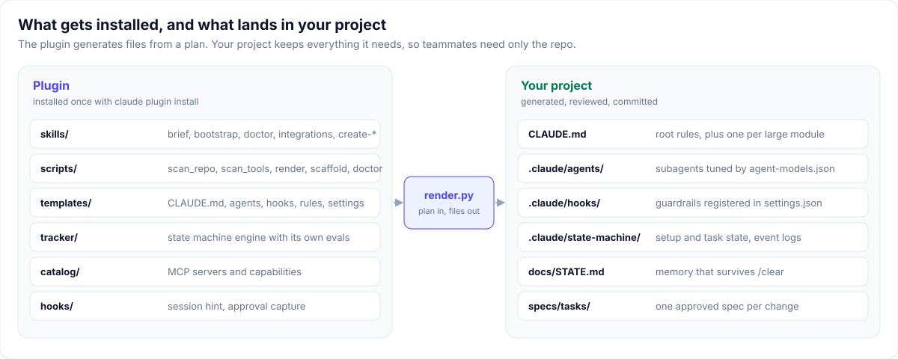
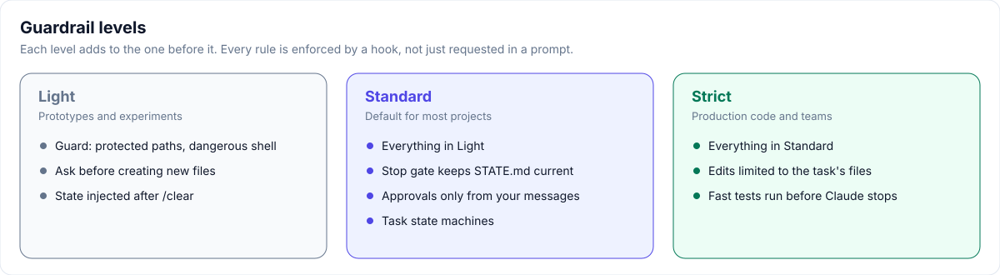
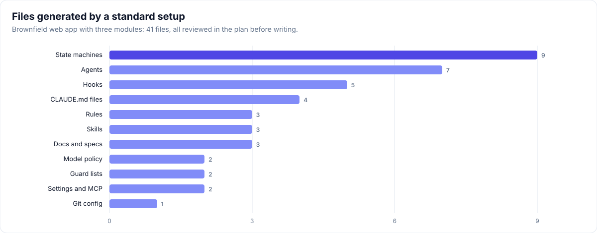

<div align="center">

# Claude Project Setup

**Set up any project for Claude Code from a plain-language description, with guardrails that are enforced rather than requested.**

[](CHANGELOG.md)
[](https://code.claude.com/docs/en/plugins)
[](docs/getting-started.md#prerequisites)
[](docs/development.md#conventions)
[](docs/development.md#test-and-validate)
[](docs/troubleshooting.md)
[](https://github.com/sarveshtalele/claude-project-setup/commits/main)

[Getting started](docs/getting-started.md) · [User guide](docs/user-guide.md) · [Documentation](#documentation) · [Changelog](CHANGELOG.md)

</div>

<p align="center"></p>

Claude Project Setup is a Claude Code plugin. You describe what you want to build, or point it at an existing repository. It drafts a brief, asks only the questions that matter, shows you the complete setup plan, and writes nothing until you approve. The result is a project with layered `CLAUDE.md` files, project-specific subagents, guardrail hooks, state-tracked tasks and memory that survives `/clear` and compaction.

## Highlights

- **Starts from a conversation.** Describe the project in chat; the plugin drafts `PROJECT-BRIEF.md` from your words and never invents requirements.
- **Greenfield and brownfield.** New projects use the stack's official scaffold. In existing repositories, source code is never modified.
- **Guardrails enforced by hooks.** Protected paths, consent before creating files, blocked destructive commands and task scope are checked by scripts, at three levels.
- **Approvals that only you can give.** Setup and tasks follow tracked states. Only your own message ("approved") unlocks the next step, and tasks can't finish without a passing verification.
- **Model optimisation you control.** One editable file sets each agent's model, effort and turn limit, with economy, balanced and quality profiles.
- **Generators for AI components.** It creates Agent Skills with step state machines, subagents and full plugin bundles that pass `claude plugin validate`.
- **Context that survives.** `docs/STATE.md` is re-injected after `/clear` and compaction, and an interrupted setup resumes where it stopped.
- **Deterministic and self-contained.** Scanning, rendering and checks are standard-library Python. Everything generated is committed, so teammates don't need the plugin.

## Installation

Requires Claude Code with plugin support, Python 3.9 or later, and git.

```bash
claude plugin marketplace add sarveshtalele/claude-project-setup
```

```bash
claude plugin install claude-project-setup@claude-project-setup
```

To try it without installing, clone the repository and run `claude --plugin-dir ./claude-project-setup/plugins/claude-project-setup`.

## Quick start

1. Open your project: `cd my-project && claude`
2. Describe it in chat, or run `/claude-project-setup:brief`:

   ```text
   I want to build a habit-tracker web app with login, daily streaks and weekly email summaries.
   ```

   ```text
   Set up this repo for Claude. Goal: add CSV export. Don't touch backend/.
   ```

3. Review `PROJECT-BRIEF.md`, then say **go**. Answer the short interview, or accept the defaults.
4. Review the setup plan and reply **approved**.
5. Start a new session, accept the workspace trust prompt, and run `/task <first requirement>`.

See [Getting started](docs/getting-started.md) for the full walkthrough.

## How it works

<p align="center"></p>

The plugin's scripts scan the repository and your installed tools without spending model tokens. Claude interviews you and writes a setup plan, and `render.py` turns that plan into files. Files you have edited are never overwritten, and upgrades only replace generated files that are unchanged. Details: [Workflow](docs/workflow.md) and [Architecture](docs/architecture.md).

## Guardrails

<p align="center"></p>

You choose the level in the brief or during the interview. Paths listed in `.claude/protected.txt` can never be written, and new files outside `.claude/write-allow.txt` need your consent. Secrets, lockfiles, force pushes and shell edits to the guardrails themselves are always blocked. Details: [Guardrails](docs/guardrails.md).

## Tasks and state machines

<p align="center"></p>

Each `/task` produces a one-page spec with allowed files and runnable acceptance checks. The task then moves through tracked states recorded in an append-only event log. Approval is recorded from your message by a hook, the verifier records whether the checks pass, and at the strict level edits outside the task's files are refused. Details: [State machines](docs/state-machines.md).

## Agents and model optimisation

| Agent | Role | Balanced profile |
|---|---|---|
| `explorer` | Finds code and returns `path:line` facts | haiku |
| `implementer` | Implements one approved task | sonnet, medium effort |
| `verifier` | Runs acceptance checks and reports real output | haiku |
| `reviewer` | Reviews the diff against the spec | session model, high effort |
| Specialists | Security, tests, migrations, UI, module experts | by role |

Change models with `/models economy`, `/models quality` or `/models implementer=opus`, or edit `.claude/agent-models.json` directly. An agent that reports `UNCERTAIN` is retried once on the next model tier. Details: [Subagents](docs/subagents.md).

## Generate skills, agents and plugins

| Command | Creates |
|---|---|
| `/claude-project-setup:create-skill` | An Agent Skill with tracked steps, review gates and evals derived from its steps |
| `/claude-project-setup:create-agent` | A subagent with the right model tier, minimal tools and a fixed output format |
| `/claude-project-setup:create-plugin` | A plugin bundle with a marketplace, shared tracker, skills, agents and README |

Generators validate names and descriptions, never overwrite existing files, and show a dry run before writing. Details: [Creating skills, agents and plugins](docs/creating-skills-and-plugins.md).

## What gets generated

<p align="center"></p>

```
your-project/
├── PROJECT-BRIEF.md            your requirements and interview decisions
├── CLAUDE.md                   root rules, at most 100 lines
├── <module>/CLAUDE.md          large or distinct modules only, at most 40 lines
├── docs/                       STATE.md, ARCHITECTURE.md, adr/
├── specs/                      TASK-TEMPLATE.md, tasks/
├── .mcp.json                   only if MCP servers were chosen; secrets as ${VAR}
└── .claude/
    ├── settings.json           permissions, hooks, plugins, attribution off
    ├── agent-models.json       model, effort and turn limit per agent
    ├── protected.txt, write-allow.txt
    ├── agents/, hooks/, rules/, skills/
    ├── state-machine/          task machines and event logs
    └── setup-manifest.json     plan and file hashes for safe upgrades
```

## Commands

| Command | Purpose |
|---|---|
| `/claude-project-setup:brief` | Draft `PROJECT-BRIEF.md` from your description |
| `/claude-project-setup:bootstrap` | Scan, interview, plan, generate and verify; resumes if interrupted |
| `/claude-project-setup:doctor` | Check setup health; `upgrade` refreshes generated files |
| `/claude-project-setup:integrations` | Review, add or remove plugins and MCP servers |
| `/task`, `/checkpoint`, `/models` | Installed into your project: plan a task, save state, change agent models |

Full reference: [Commands](docs/commands.md).

## Documentation

| Guide | Contents |
|---|---|
| [Getting started](docs/getting-started.md) | Prerequisites, installation, first run, updates |
| [User guide](docs/user-guide.md) | Daily loop: brief, bootstrap, tasks, checkpoints |
| [Workflow](docs/workflow.md) | Bootstrap step by step, greenfield and brownfield |
| [Guardrails](docs/guardrails.md) | Levels, hooks, protected paths, permissions |
| [State machines](docs/state-machines.md) | Setup and task machines, approvals, resume |
| [Subagents](docs/subagents.md) | Agent templates, model profiles, escalation, `create-agent` |
| [Creating skills, agents and plugins](docs/creating-skills-and-plugins.md) | Project types and generators |
| [Integrations](docs/integrations.md) | Plugins and MCP servers, secrets, permissions |
| [Context management](docs/context-management.md) | `STATE.md`, session protocol, token savings |
| [Architecture](docs/architecture.md) | Plugin internals, file classes, upgrade path |
| [Commands](docs/commands.md) | Every skill, command and script |
| [Troubleshooting](docs/troubleshooting.md) | Common problems and fixes |
| [Development](docs/development.md) | Repository layout, tests, release process |

Test reports: [v0.4 phases](docs/reports/v0.4-phases.md) and [tokentelemetry end-to-end](docs/reports/e2e-tokentelemetry.md). Background: [roadmap](docs/roadmap/v0.4-plan.md), [session audit](docs/background/session-audit.md), [playbook](docs/background/playbook.md).

The plugin installs only `plugins/claude-project-setup/`. Documentation stays in this repository.

## Development

```bash
python3 plugins/claude-project-setup/tests/test_scripts.py
```

```bash
claude plugin validate . && claude plugin validate plugins/claude-project-setup
```

The suite has 28 tests and runs the tracker's own 23 evals. See [Development](docs/development.md) for conventions and the release process.

## Contributing

Issues and pull requests are welcome. Please include a failing test with each bug fix, keep scripts to the Python standard library, and run both commands above before opening a pull request.

## License

No license has been chosen yet, so all rights are reserved by default. Open an issue if you would like to use or contribute to this project.
