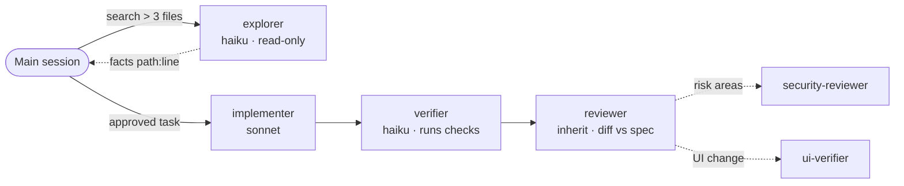

# Agents

Generated into `.claude/agents/`, with your real commands, paths and risk areas filled in.

| Agent | Included | Model | Writes? | Role |
|---|---|---|---|---|
| `explorer` | always | haiku | no | Finds code; returns at most 30 lines of `path:line` facts |
| `implementer` | always | sonnet | allowed files only | Implements one approved task |
| `verifier` | always | haiku | no | Runs acceptance commands and reports PASS/FAIL with real output |
| `reviewer` | always | inherit | no | Checks the diff against the spec, security, protected areas and drift |
| `security-reviewer` | brief lists risk areas | inherit | no | Trust boundaries, auth, secrets, PII |
| `test-writer` | tests missing or thin | sonnet | tests only | Writes tests that fail when behaviour breaks |
| `migration-reviewer` | DB or framework migration | inherit | no | Reversibility, data safety, parity on unmodified converter output |
| `ui-verifier` | frontend detected | sonnet | no | Real browser, console errors, screenshots outside the repo |
| `<module>-expert` | large modules you pick (≤ 3) | sonnet | that module | Owns one module and its local rules |

**Why these models**
- Search and verification are cheap and mechanical, so they run on **haiku**.
- Implementation needs reliability at reasonable cost, so it runs on **sonnet**.
- Review and security judgement **inherit** your session model.

**State machine duties** (standard and strict): `implementer` runs `move start` and `move submit`; `verifier` runs `record verify_passed` and `move pass`, or `move fail`.

**Rules every agent follows**
- It works only inside the task's scope, and stops and reports rather than widening it.
- A blocked hook gets reported. It never looks for a workaround.
- It returns a fixed, short format so the main context stays small.
