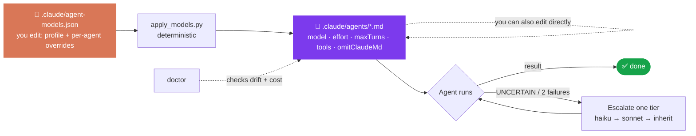

# Agents

Generated into `.claude/agents/`, with your real commands, paths and risk areas filled in.

| Agent | Included | Model | Writes? | Role |
|---|---|---|---|---|
| `explorer` | always | haiku | no | Finds code; returns at most 30 lines of `path:line` facts |
| `implementer` | always | sonnet | allowed files only | Implements one approved task |
| `verifier` | always | haiku | no | Runs acceptance commands and reports PASS/FAIL with real output |
| `reviewer` | always | inherit | no | Checks the diff against the spec, security, protected areas and drift |
| `security-reviewer` | brief lists risk areas | inherit | no | Trust boundaries, auth, secrets, PII |
| `test-writer` | tests missing or thin | sonnet | tests only | Writes tests that fail when behaviour breaks |
| `migration-reviewer` | DB or framework migration | inherit | no | Reversibility, data safety, parity on unmodified converter output |
| `ui-verifier` | frontend detected | sonnet | no | Real browser, console errors, screenshots outside the repo |
| `<module>-expert` | large modules you pick (≤ 3) | sonnet | that module | Owns one module and its local rules |

The models above are the **balanced** profile. Every model setting comes from one file you can edit.

## Model optimisation

| Technique | Setting | Saves |
|---|---|---|
| Model routing by role | `model`: haiku to search/check, sonnet to build, inherit to judge | Cost per call |
| Reasoning budget | `effort` per role (`null` = the session's own, used for haiku) | Thinking tokens |
| Turn cap | `maxTurns` | Runaway loops |
| Lean context | `omitClaudeMd: true` for scouts | Context loaded at agent start |
| Least privilege | `tools` allowlist (+ optional `disallowedTools`) | Tool-definition tokens and mistakes |
| Short output contract | a fixed reply format (≤ 15–30 lines) | Growth of the main context |
| Escalate, don't over-provision | `UNCERTAIN:` line → retried **once** one tier up (Agent tool `model` parameter) | Paying for the top model by default |

**Profiles** (`"profile"` in the file):

| Agent | economy | balanced *(default)* | quality |
|---|---|---|---|
| explorer · verifier | haiku | haiku | sonnet / low |
| ui-verifier | haiku | sonnet / low | sonnet / medium |
| test-writer | haiku | sonnet / medium | sonnet / high |
| implementer | sonnet / low | sonnet / medium | inherit / high |
| `*-expert` | sonnet / low | sonnet / medium | sonnet / high |
| reviewers | sonnet / medium | inherit / high | inherit / high |

**Three ways to change models**
1. `/models economy` (or `balanced`, `quality`): switches the whole profile.
2. `/models implementer=opus`: sets a per-agent override (globs work, e.g. `*-expert=haiku`).
3. Edit `.claude/agent-models.json`, or an agent's frontmatter, by hand. `doctor` shows a WARN when an agent differs from the policy, and never overwrites your change.

Notes:
- `/models apply` rewrites only the managed keys, so your edits to agent prompts survive.
- Plugin upgrades read your policy file and never replace it.
- An invalid policy (an unknown model or effort) is refused, and nothing is written.

## Create your own agent
`/claude-project-setup:create-agent an agent that reviews SQL migrations`
1. Asks up to 4 questions: the role, whether it writes, its scope and its output.
2. Picks a tier: **scout** (haiku, read-only), **builder** (sonnet, edits) or **judge** (inherit, read-only).
3. Gives it the fewest tools, a fixed output format and the `UNCERTAIN` rule.
4. Writes the file after you agree, adds it to all 3 profiles, and gives you a test prompt.

**State machine duties** (standard and strict): `implementer` runs `move start` and `move submit`; `verifier` runs `record verify_passed` and `move pass`, or `move fail`.

**Rules every agent follows**
- It works only inside the task's scope, and stops and reports rather than widening it.
- A blocked hook gets reported. It never looks for a workaround.
- It returns a fixed, short format so the main context stays small.
