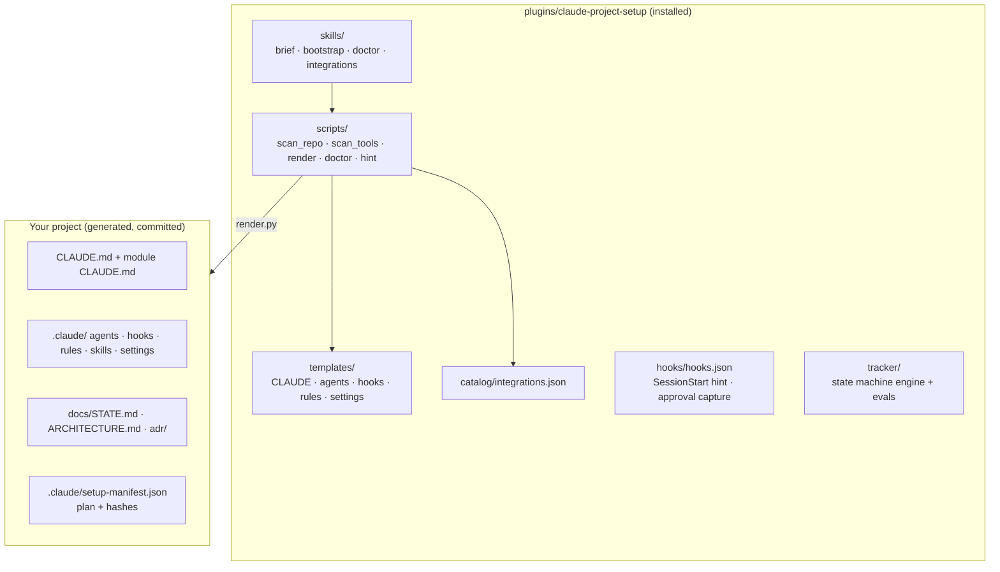
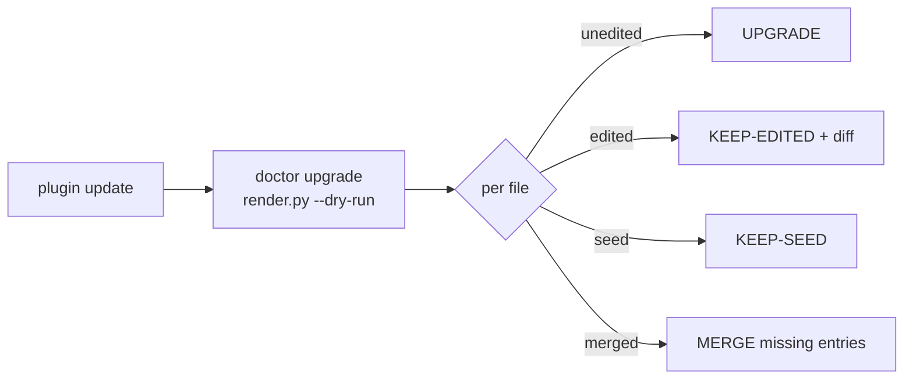

# Architecture

## Design principles
- **Deterministic core.** Scanning, classifying, rendering and health checks are Python standard-library scripts. The model only interviews you and fills in the plan.
- **Plan in, files out.** `render.py` takes one JSON plan and produces the same files every time.
- **Your files win.** `render.py` never overwrites a file it didn't generate, and never upgrades one you edited.
- **The project is self-contained.** Teammates don't need the plugin.

## render.py file classes
| Class | Files | Behaviour |
|---|---|---|
| Owned | agents, hooks, rules, skills, CLAUDE.md files, guard lists, TASK template | CREATE if absent · UPGRADE if unedited (hash match) · KEEP-EDITED (diff shown) · SKIP if it exists but wasn't generated by the plugin |
| Seed | `docs/STATE.md`, `docs/ARCHITECTURE.md` | Created once; yours afterwards (never diffed) |
| Copied verbatim | `.claude/state-machine/` (CLI, task definition, tracker scripts) | Owned rules (hash-checked), no variables |
| Merged | `.claude/settings.json`, `.mcp.json`, `.gitignore`, `.env.example` | Union merge: your entries are kept, and only missing ones are added |

Exit code `2` means the plan is invalid (missing variable, unknown template, literal secret). **Nothing is written** in that case.

## Scripts
| Script | Input | Output |
|---|---|---|
| `scan_repo.py [ROOT]` | Files (respects `.gitignore`) | JSON: mode, stack, modules, instructions |
| `scan_tools.py [ROOT] --scan --needs` | `claude` CLI, `.mcp.json`, catalog | JSON: REUSE/ADD/SKIP/CONFLICT, token cost |
| `render.py --target --plan [--dry-run] [--show]` | Plan JSON, or the manifest | Files + `.claude/setup-manifest.json` |
| `doctor.py [ROOT] [--tools]` | The project | PASS/WARN/FAIL table; exits 1 on any FAIL |
| `hint.py` | `CLAUDE_PROJECT_DIR` | One line before setup, or "resume at <state>"; silent after |
| `templates/state-machine/state_cli.py` | The event logs | Bootstrap and task machines ([State machines](state-machines.md)) |

## Upgrade path

