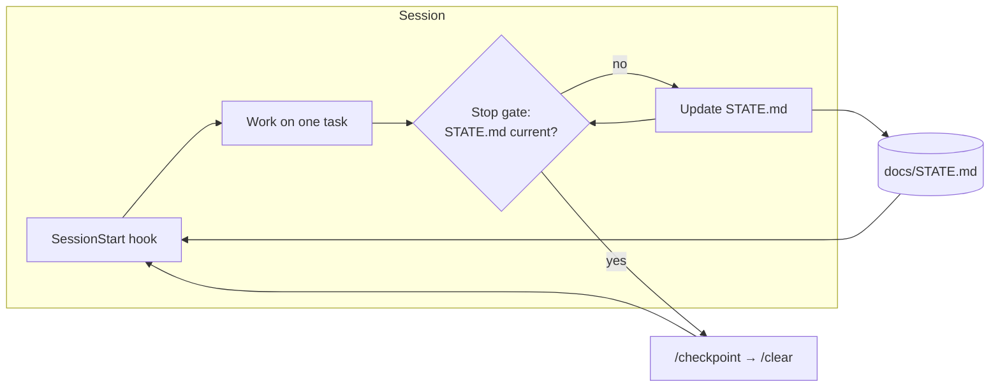

# Context management

**Files are memory; the chat isn't.** Each session starts from the project's files, not from conversation history.

## Where things live
| Need | File | Loaded |
|---|---|---|
| Stable rules and commands | `CLAUDE.md` (≤ 100 lines) | Every session |
| Module rules | `<module>/CLAUDE.md` (≤ 40 lines) | Only when working in that folder |
| Rules for a file type | `.claude/rules/*.md` with `paths:` | Only when matching files are touched |
| Where we are now | `docs/STATE.md` (≤ 60 lines) | Injected at start, resume, clear and compaction |
| One change | `specs/tasks/TASK-NNN-*.md` | While that task is worked on |
| Why the architecture is the way it is | `docs/adr/` | On demand |
| Decisions from setup | `PROJECT-BRIEF.md` → `## Decisions` | On demand |

## Session protocol
- **Start:** open a new session (not `--resume` across days). The hook injects STATE.
- **Finish a task:** run `/checkpoint`, then `/clear`.
- **Long session:** run `/checkpoint`, then `/compact keep: current task file, failing tests`.
- **Second compaction:** stop, run `/checkpoint`, then start a new session; the task was too big.
- **Usage limit hit:** the Stop hook already kept STATE current, so just start a new session.

## Token savers built in
- Repo mapping uses scripts, not exploration.
- The explorer and verifier run on haiku.
- Deny rules keep build output and lockfiles out of context.
- Each plugin's always-on token cost is shown before you enable it.
- SKILL.md files stay under 200 lines, with details in `references/`.
