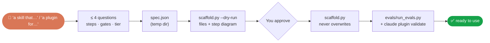
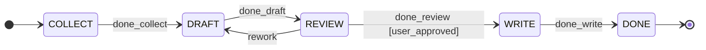

# Creating skills, agents and plugins

Setup recognises five **project types**, and has a generator for each kind of AI component.

| Type | Detected by (`scan_repo.py`) | After the base setup, offers |
|---|---|---|
| `app` | A web/UI or service framework (React, Next.js, FastAPI, Django, Express…) | n/a |
| `library` | A manifest with no app framework | n/a |
| `skill` | A `SKILL.md` outside `.claude/` | `create-skill` |
| `agents` | `agents/*.md` and no manifest | `create-agent` |
| `plugin` | `.claude-plugin/plugin.json` or `marketplace.json` | `create-plugin` |
| `unknown` | Empty folder | One interview question decides |



## A skill (`/claude-project-setup:create-skill`)
You describe the outcome, the steps and which steps need your review. You get:

```
.claude/skills/<name>/          (or a path you choose)
├── SKILL.md                    portable frontmatter (name, description); steps with begin/done
├── machine.json                its state machine (if tracked)
├── scripts/skill_state.py      start · begin · done · rework · status · report
├── evals/run_evals.py          structure + step-order + gate + full-run checks, plus your cases
├── evals/evals.json            your own input/output cases
└── tracker/                    vendored tracker (standalone skills only), with VERSION.json hash
```

**Tracking** is on automatically for 3 or more steps or any review gate. Each step becomes a state:


- `begin <step>` refuses a step that isn't next (exit 5).
- `done <gate>` refuses until **you** approve (exit 4). In a project set up by this plugin, your reply (`approved`, or `approve skill-<name>`) is recorded by the approval hook. In other projects, `skill_state.py approve "<your words>"` records it.
- `rework` returns to the previous step, and the next pass needs a fresh approval.
- Runs live in `.claude/state-machine/.state-machine/skill-<name>/`; `report` writes the progress and changelog for each one.

## An agent (`/claude-project-setup:create-agent`)
Tier → model per profile → fewest tools → fixed output → `UNCERTAIN` rule → added to all three profiles. See [Agents](agents.md#create-your-own-agent).

## A plugin or skill bundle (`/claude-project-setup:create-plugin`)
```
<repo>/
├── .claude-plugin/marketplace.json    installable with `claude plugin marketplace add`
├── README.md                          install commands, skills and agents tables
└── plugins/<name>/
    ├── .claude-plugin/plugin.json
    ├── skills/<skill>/…               as above, minus tracker/
    ├── agents/<agent>.md              tier model, tools, turn cap, output contract
    └── tracker/                       ONE copy shared by every skill (no drift to manage)
```
Done means both `claude plugin validate .` and `claude plugin validate plugins/<name>` pass, and every skill's evals pass.

## Rules the generator enforces
| Rule | On violation |
|---|---|
| The name is lowercase-hyphenated, ≤ 64 chars | Exit 2, nothing written |
| The description is 40–1024 chars and includes "Use when…" | Exit 2 |
| Step ids are unique snake_case, and the first step isn't a gate | Exit 2 |
| An agent tier is scout, builder or judge | Exit 2 |
| Any target file already exists | Exit 3, nothing written |

Tested end to end on a real repo (a generated `release-notes` skill: refused out of order, gate held until "approve skill-release-notes", report rendered). See the [report](reports/phase1-2-state-machines.md#phase-4-project-types-and-generators).
