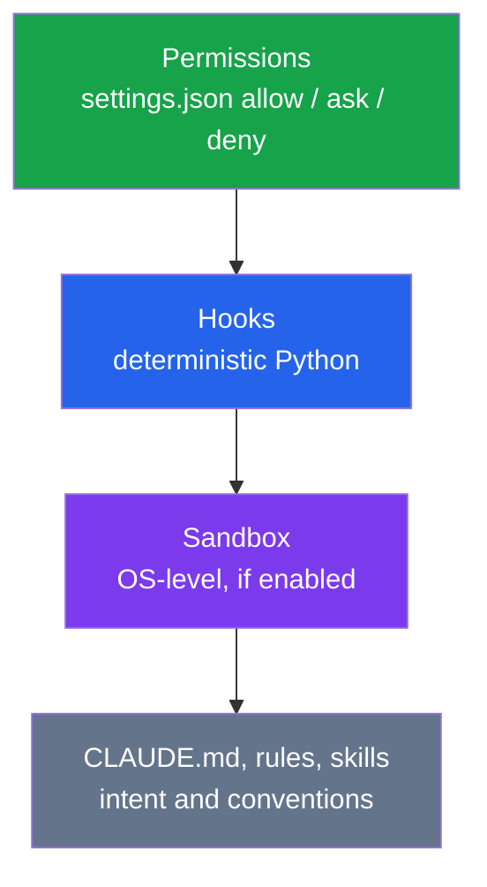
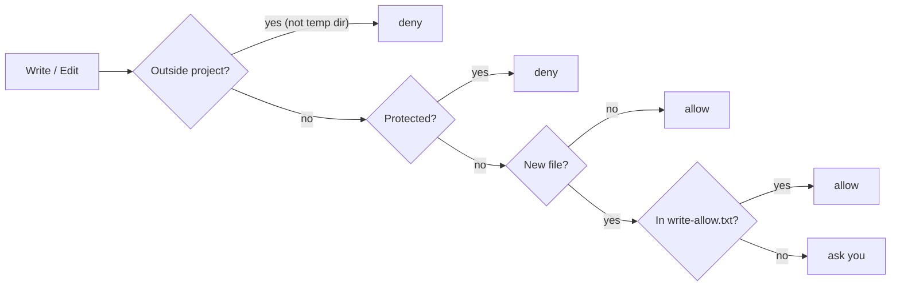

# Guardrails

Rules are enforced in layers. Each rule goes in the strongest layer that can express it.



## Levels

| Level | Hooks | Use when |
|---|---|---|
| **light** | guard · session_context | Prototypes, solo experiments |
| **standard** (default) | + stop_gate · approval_capture · task state machines | Most projects |
| **strict** | + scope_check · test_on_stop | Production code, teams, regulated areas |

`format_on_edit` is a separate yes/no choice. `selftest.py` is always installed.

## Hooks

| Hook | Event | Does |
|---|---|---|
| `guard.py` | PreToolUse: Write, Edit, MultiEdit, NotebookEdit, Bash | Denies protected paths and dangerous shell; asks before new files and installs |
| `session_context.py` | SessionStart: startup, resume, clear, compact | Injects `docs/STATE.md` and git status |
| `stop_gate.py` | Stop | Blocks once if code changed after STATE.md was last updated |
| `approval_capture.py` | UserPromptSubmit | Records `user_approved` from **your** message ("approved", "approve TASK-007"); see [State machines](state-machines.md) |
| `scope_check.py` | PreToolUse: Write, Edit, MultiEdit | Denies edits outside the Allowed files of the task in progress (read from the task machine) |
| `test_on_stop.py` | Stop | Runs `FAST_TEST_CMD`; a failure (or a command that can't run) blocks once |
| `format_on_edit.py` | PostToolUse: Write, Edit, MultiEdit | Runs your formatter on the edited file only; never blocks |

## What guard.py decides



| Always denied | Always asks |
|---|---|
| `.env*`, `*.pem`, `*.key`, `secrets/` | `npm/pnpm/yarn/bun add/install <pkg>` |
| Lockfiles, `.git/` | `pip/uv/poetry install/add` |
| `.claude/settings.json`, `.claude/hooks/`, `protected.txt`, `setup-manifest.json` | `git push` |
| `rm -rf /`, `~` or `..`; `sudo`; `curl \| sh`; `chmod -R 777` | `git commit` (permission rule) |
| `git push --force`, `reset --hard`, `clean -f`, `--no-verify` | `claude plugin install`, `claude mcp add` |
| `npm publish`; reading `.env`; shell writes to guardrail files | WebFetch |
| Shell commands containing `user_approved`; edits to `.state-machine/` logs | |

## Files you edit

| File | Effect |
|---|---|
| `.claude/protected.txt` | One glob per line that Claude can never write (`*` crosses `/`) |
| `.claude/write-allow.txt` | Globs where new files are created without asking |
| `.claude/settings.json` | Permissions. You edit it; Claude can't (the guard denies it) |

## Defaults in `settings.json`
- `attribution.commit` and `attribution.pr` are empty, so commits and PRs **carry no AI co-author line**.
- Read deny rules cover `node_modules/`, `dist/`, `build/`, `coverage/` and lockfiles, which keeps them out of context.
- `sandbox.enabled: true`.

## Prove it
```bash
python3 .claude/hooks/selftest.py
```
Expected: a line starting with `OK: <n> guard cases` (27 built-in checks, plus one per glob in your `protected.txt`), listing the hooks checked at your level.
