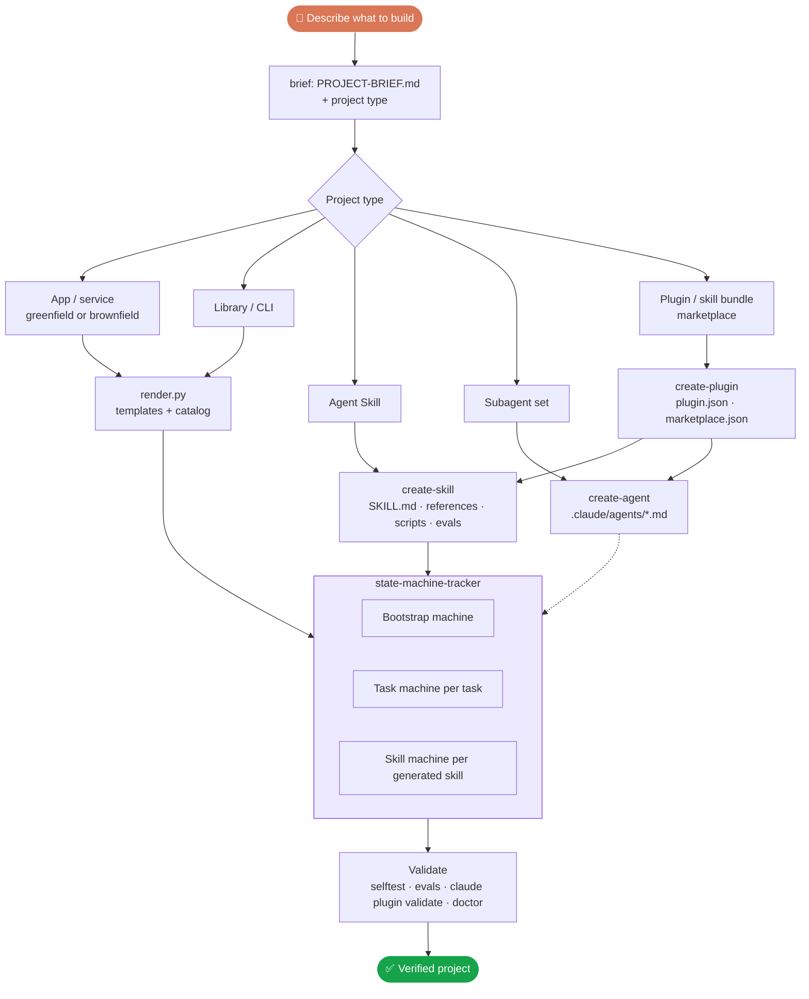
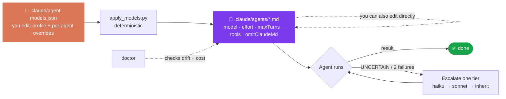
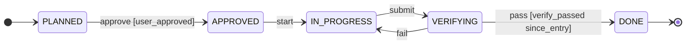

# Roadmap: v0.4 (project types, agent model optimisation, state tracking)

**Status:** approved 2026-10-01 · phases run in order, with a go/no-go after each.

## How it will work

## 1. Project types
| Type | Detected by | Creates |
|---|---|---|
| App / service | A manifest plus a framework | Today's flow: CLAUDE.md files, agents, hooks, guardrails, MCP |
| Library / CLI | A manifest with no app framework | The same, plus public-API and versioning rules |
| Agent Skill | "a skill that…", or `SKILL.md` exists | `SKILL.md` (≤ 200 lines), `references/`, `scripts/`, `evals/`, optional state machine |
| Subagent set | "agents for…", or `.claude/agents/` exists | Agents tuned by the model policy (§2), with a test prompt for each |
| Plugin / skill bundle | "a plugin…", or `.claude-plugin/` exists | `plugin.json`, `marketplace.json`, skills, agents, hooks; must pass `claude plugin validate` |

Each type also gets the base setup: `CLAUDE.md`, `STATE.md`, guardrails, `/task`, `/checkpoint`.

## 2. Agent creation and model optimisation (you can edit it)

**Techniques applied to every generated agent**
| Technique | Mechanism (subagent frontmatter) | Saves |
|---|---|---|
| Model routing by role | `model`: haiku for searching and checking, sonnet for building, inherit for judging | Cost per call |
| Reasoning budget | `effort`: low / medium / high, per role | Thinking tokens |
| Turn cap | `maxTurns` | Runaway loops |
| Minimal tools | `tools` allowlist, `disallowedTools` | Tool-definition tokens; mistakes |
| Lean context | `omitClaudeMd: true` for read-only agents that don't need project rules | Context loaded at agent start |
| Preloaded skills only when needed | `skills` | On-invoke tokens |
| Fixed short output | An output contract in each agent prompt (≤ 15–30 lines) | Main-context growth |
| Escalate, don't over-provision | An agent returns `UNCERTAIN`; the main session retries **one** tier up, at most once | Paying for opus by default |

**Default policy: `.claude/agent-models.json` (profile `balanced`)**
| Agent | model | effort | maxTurns | omitClaudeMd |
|---|---|---|---|---|
| explorer | haiku | low | 25 | true |
| verifier | haiku | low | 15 | true |
| ui-verifier | sonnet | low | 25 | true |
| test-writer | sonnet | medium | 40 | false |
| implementer | sonnet | medium | 60 | false |
| `<module>`-expert | sonnet | medium | 40 | false |
| reviewer · security-reviewer · migration-reviewer | inherit | high | 20 | false |

Profiles:
- **economy**: reviewers on sonnet/medium, test-writer on haiku.
- **balanced**: the default above.
- **quality**: explorer on sonnet, implementer inherits.

Per-agent `overrides` always win over the profile.

**Two ways to edit**
1. Edit `.claude/agent-models.json` (a profile or overrides), then run `/models apply`. The project script `apply_models.py` rewrites only those frontmatter keys in each agent file, so it works without the plugin.
2. Edit an agent's frontmatter directly. `doctor` reports the difference from the policy as a WARN, never an error, so your edit is respected.

`create-agent` builds new agents from the same policy: role, then a model tier, then the fewest tools, then the output contract, then a test prompt.

## 3. State tracking: 3 machines
| Machine | Lives in | Enforces |
|---|---|---|
| Bootstrap | Plugin | `render.py` writes only in `APPROVED`; resumable after a usage limit or compaction |
| Task (one per `/task`) | `.claude/state-machine/` | Can't start without `user_approved`; can't reach `DONE` without `verify_passed` since the last entry into verification; `scope_check` reads the real task state |
| Skill (one per generated skill) | Inside the generated skill | Step scripts check their state first; `progress.md` and `changelog.md` are rendered from the events |

**Where the tracker code lives** (one copy per installable unit, with a hash recorded and drift checked by `doctor`):
- the plugin itself;
- the project's `.claude/state-machine/`;
- the plugin root, for bundles;
- `skill/tracker/`, for standalone skills only.

## 4. Phases
| Phase | Work | Go/no-go |
|---|---|---|
| **P1: prove the tracker** | Code review of all 8 scripts; on a scratch clone of **mcp-skills-registry**: normal flow, illegal moves, loop guard, crash recovery, two writers and stale lock, several machines, decoupling from migration-factory references, Windows syntax, cost | All pass → report, and you approve P2 |
| **P2: tracker in the plugin** | Bootstrap and task machines, the render check, `scope_check` on real state, `/task`, `/checkpoint` and the verifier recording events, tests | Tests green, plus re-running the tokentelemetry end-to-end test |
| **P3: agent model policy** | `agent-models.json`, `apply_models.py`, `/models`, `create-agent`, escalation rules, doctor drift and cost checks, tests | Frontmatter fields verified against the Claude Code docs; all 3 profiles render valid agents |
| **P4: project types and generators** | Type detection, `create-skill`, `create-plugin`, the skill machine | A sample skill and a sample plugin bundle generated, with their evals and `claude plugin validate` passing |
| **P5: docs and release** | Docs pages, README diagrams, CHANGELOG, v0.4.0 | Diagrams render, links resolve, you approve the push |

## Decisions (defaults accepted)
- All 5 project types.
- The tracker is on by default for generated skills with 3 or more steps or an approval gate.
- Phase 1 test repo: mcp-skills-registry.
- Generated skill scripts use Python's standard library.
- Agent model profile: `balanced`.
