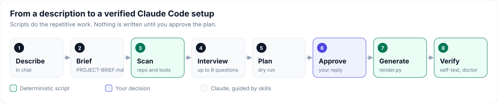

# Setup guide

Step-by-step instructions for setting up any project with Claude Project Setup. Pick your scenario, follow its steps in order, then continue with [After setup](#after-setup).

<p align="center"></p>

## Before you start

1. Check the prerequisites: Claude Code with plugin support, Python 3.9 or later, and git.

   ```bash
   claude --version && python3 --version && git --version
   ```

2. Install the plugin once per machine.

   ```bash
   claude plugin marketplace add sarveshtalele/claude-project-setup
   ```

   ```bash
   claude plugin install claude-project-setup@claude-project-setup
   ```

3. Choose a folder outside your repository for run outputs, clones and screenshots, for example `~/work/<project>-runs`.

## Choose your scenario

| Scenario | Use when | Go to |
|---|---|---|
| New application | Empty folder; you want a web, mobile, desktop app or service | [A](#a-new-application-greenfield) |
| Existing repository | Code already exists | [B](#b-existing-repository-brownfield) |
| Large repository or monorepo | Several apps or packages, or more than a few hundred files | [B](#b-existing-repository-brownfield), then [C](#c-large-repository-or-monorepo) |
| Library or CLI | A package or command-line tool | [D](#d-library-or-cli) |
| Agent Skill | You are building a skill for Claude | [E](#e-agent-skill) |
| Claude Code plugin | You are building a plugin or skill bundle | [F](#f-claude-code-plugin) |

## A. New application (greenfield)

1. Create the folder, initialise git and start Claude Code.

   ```bash
   mkdir my-app && cd my-app && git init && claude
   ```

2. Describe the application in one message. Include who it is for, the main features and any constraints.

   ```text
   I want to build a habit-tracker web app. Users sign in, track daily habits, see streaks,
   and get a weekly email summary. It must work on mobile browsers.
   ```

3. Claude drafts `PROJECT-BRIEF.md` and asks before writing it. Reply **yes**.
4. Open `PROJECT-BRIEF.md` in your editor. Check that each requirement is one line with one goal. Fill in anything you know: stack, risk areas (for example auth, PII), protected areas, guardrail level, outputs folder. Leave the rest as `recommend`.
5. Reply **go**. Claude scans the folder and your installed plugins and MCP servers, then asks at most 2 rounds of questions. Pick the recommended option when unsure.
6. Claude shows the architecture, the scaffold command and the setup plan, which lists every file to create. Read it. Ask for changes if needed; each change produces a new plan.
7. Reply **approved**. Claude runs the official scaffold in a temporary folder and moves its files in, because generators refuse a folder that already holds the brief. If the template has no test runner, Claude adds one with a first passing test. It then confirms that install, test, lint and build work, and writes the setup.
8. Claude runs the self-test and `doctor`. Both must pass with no FAIL rows.
9. Commit when Claude asks (`chore: claude project setup`).
10. Continue with [After setup](#after-setup).

## B. Existing repository (brownfield)

1. Start from a clean working tree on a branch.

   ```bash
   cd my-repo && git status && git switch -c chore/claude-setup && claude
   ```

2. Describe the goal and any limits in one message.

   ```text
   Set up this repo for Claude. Goals: add CSV export and a date filter.
   Don't touch backend/ or .github/workflows/.
   ```

3. Claude scans the repository. It detects the languages, frameworks, scripts, tests, modules and existing instruction files (`CLAUDE.md`, `AGENTS.md`, `.cursorrules`). It then drafts the brief with your stack pre-filled as `keep current`. Reply **yes** to create it.
4. Review the brief. Put every area Claude must never change under **Protected areas**, one glob per line (for example `backend/*`).
5. Reply **go** and answer the interview. Claude runs each detected command once (test, lint, build) before using it. A command that fails is recorded as `n/a` and listed as a known gap.
6. Review the setup plan. Check three things:
   - No source files are listed. Only `CLAUDE.md` files, `docs/`, `specs/`, `.claude/`, `.mcp.json`, `.env.example`, `.gitignore` and the brief may change.
   - An existing `CLAUDE.md` shows as **SKIP**; Claude merges it by hand and shows you the diff.
   - An existing `docs/ARCHITECTURE.md` shows as **SKIP** and is kept.
7. Reply **approved**. Claude writes the setup, then runs the self-test and `doctor`.
8. Review the diff with `git diff --stat`, then commit.
9. Continue with [After setup](#after-setup).

## C. Large repository or monorepo

Apply these extra steps during scenario B.

1. In the interview, accept a **module `CLAUDE.md`** for each folder that has its own manifest, more than 150 source files, or a different language from the root. Each module file holds at most 40 lines.
2. For the biggest modules you work in often (at most 3), accept a **module expert** agent.
3. Accept path-scoped rules (`api`, `ui`, `testing`) instead of repeating the same rule in every module file.
4. Large generated or output folders inside the repository get a Read deny rule. Move them outside the repository when you can.
5. After setup, run `/claude-project-setup:doctor`. It reports folders that have grown past the module threshold without a `CLAUDE.md`.

## D. Library or CLI

Follow scenario A or B. In the brief, set **Project type** to `library`.

1. During the interview, protect generated files and published artifacts (for example `dist/*`).
2. Make sure the fast test command runs without an activated virtual environment, for example `.venv/bin/python -m pytest` or `uv run pytest`.
3. After setup, add a path-scoped rule for the public API, for example `.claude/rules/public-api.md`:

   ```markdown
   ---
   paths:
     - "src/<package>/__init__.py"
   ---
   - Changing an exported name or signature needs a version bump, or a task that lists every consumer.
   ```

## E. Agent Skill

1. Set up the repository with scenario A or B, using project type `skill`.
2. Run `/claude-project-setup:create-skill` and describe the outcome, the steps and the steps that need your review.

   ```text
   A skill that drafts release notes from the git log since the last tag,
   with a review before writing the file.
   ```

3. Review the dry run: the file list and the step diagram. Reply **yes** to write it.
4. Run the skill's evals. All of them must pass.

   ```bash
   python3 .claude/skills/<name>/evals/run_evals.py
   ```

5. Try it: `/<name>`. At the review gate, reply **approved** or describe the changes you want.
6. Add real input and output cases to `evals/evals.json` as you use the skill.

## F. Claude Code plugin

1. Set up the repository with scenario A, using project type `plugin`.
2. Run `/claude-project-setup:create-plugin` and describe the purpose, the skills and any agents (scout, builder or judge).
3. Review the dry run, then reply **yes**.
4. Validate the plugin and run every skill's evals.

   ```bash
   claude plugin validate . && claude plugin validate plugins/<name>
   ```

   ```bash
   python3 plugins/<name>/skills/<skill>/evals/run_evals.py
   ```

5. Try it locally before publishing: `claude --plugin-dir ./plugins/<name>`.
6. Push the repository. Users install it with `claude plugin marketplace add <owner>/<repo>`.

## After setup

1. **Start a new session.** New hooks, agents and `CLAUDE.md` files load at session start.
2. **Accept the workspace trust prompt.** Claude Code ignores the project's allow rules until you do.
3. **Plan the first change.**

   ```text
   /task add CSV export to the reports page
   ```

4. Review the task spec (allowed files, non-goals, acceptance commands) and reply `approve TASK-001`.
5. Let the implementer, verifier and reviewer run. The task reaches DONE only when the verifier records a pass.
6. Commit, then run `/checkpoint` and `/clear` before the next task.

## Keep it healthy

| When | Do |
|---|---|
| Weekly, or when something feels off | `/claude-project-setup:doctor` |
| After updating the plugin | `/claude-project-setup:doctor upgrade`, then review the dry run |
| Sessions feel expensive | `/claude-project-setup:doctor --tools`, then `/models economy` |
| A task is too hard for an agent | `/models <agent>=opus` for that agent |
| A rule changed | Edit `.claude/protected.txt` or `.claude/write-allow.txt`, then run `python3 .claude/hooks/selftest.py` |

## Team rollout

1. Commit everything that setup generated, including `.claude/` and the state-machine event logs.
2. Teammates clone the repository and accept the trust prompt. They do not need the plugin.
3. Teammates who want to run `doctor` or the generators install the plugin.
4. Each person's private preferences go in `CLAUDE.local.md`, which is ignored by git.

## Checklist

- [ ] The brief lists one goal per requirement, and protected areas are filled in.
- [ ] The setup plan was reviewed, and no source files were listed for an existing repository.
- [ ] The self-test prints `OK`, and `doctor` shows no FAIL rows.
- [ ] Every command in `CLAUDE.md` ran successfully, or is marked `n/a`.
- [ ] Outputs are configured to go to a folder outside the repository.
- [ ] Commit attribution is off (`attribution` in `.claude/settings.json`).
- [ ] The first task was planned with `/task` and approved by you.

Problems: see [Troubleshooting](troubleshooting.md).
