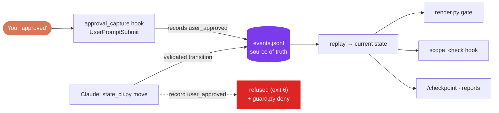
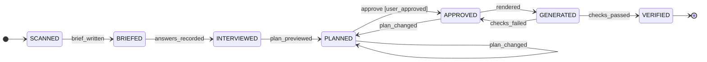
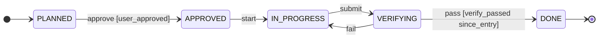

# State machines

Every important step is a **state transition in an append-only event log**. That gives you three things: the setup resumes after an interruption, steps can't run out of order, and approvals come only from your own words.



## The machines

**Bootstrap** (one per project). It starts when you agree to create the brief.

- `render.py` **refuses** to write a first-time setup unless the machine is in `APPROVED`. It moves the machine to `GENERATED` itself.
- Approval only counts for the plan it was given to (`since_entry`). Changing the plan afterwards needs a new "approved".
- If a session ends partway, the next session's start hook tells Claude where to resume.

**Task** (one per `/task`, at the standard and strict levels).


| Who | Does |
|---|---|
| `/task` | `new <task-id>` after writing the spec, then waits for your approval |
| You | Reply `approved` or `approve TASK-007`; the hook records it |
| `/task` | `move <task-id> approve` |
| `implementer` | `move start`, and `move submit` once the acceptance commands pass |
| `verifier` | PASS: `record verify_passed`, then `move pass` · FAIL: `move fail` |
| `scope_check` (strict) | While a task is `APPROVED`, `IN_PROGRESS` or `VERIFYING`, it blocks edits outside that task's Allowed files |
| `/checkpoint` | Writes the current task state into `docs/STATE.md` |

## What counts as an approval
- A short message (≤ 80 characters) that starts with `approved`, `approve`, `lgtm`, `go ahead`, `proceed`, `ship it` or `looks good`, optionally followed by a task id. Examples: `approved`, `approve TASK-007`, `Approved.`
- Ignored: anything containing `but`, `not`, `don't`, `except`, `change`, `wait`, `hold` or `no`, and a bare `yes`.
- If several items are waiting, the hook asks you to name one.
- **Limit:** this protects against *accidental* skipping. A deliberately misbehaving agent with shell access could still edit files outside the hooks' reach. The guard blocks the obvious routes (the `user_approved` string in shell commands, and writes to the event logs).

## Commands
```bash
python3 .claude/state-machine/state_cli.py status            # every machine
python3 .claude/state-machine/state_cli.py status TASK-007-x # one machine, with its legal next moves
python3 .claude/state-machine/state_cli.py active            # tasks being worked on
python3 .claude/state-machine/state_cli.py report TASK-007-x # progress.md + changelog.md
```

## Files
| Path | What it holds |
|---|---|
| `.claude/state-machine/state_cli.py` | The CLI used by skills, agents and hooks |
| `.claude/state-machine/task.json` | The task machine definition |
| `.claude/state-machine/tracker/scripts/` | The tracker itself (7 scripts) |
| `.claude/state-machine/.state-machine/<id>/events.jsonl` | **The truth.** Commit it; it's your audit trail |
| `…/<id>/state-snapshot.json` | A cache, rebuilt by `tracker/scripts/resume.py` |

The tracker is derived from the `state-machine-tracker` skill, with 4 bug fixes found in testing; see [Phase 1–2 report](reports/phase1-2-state-machines.md).
