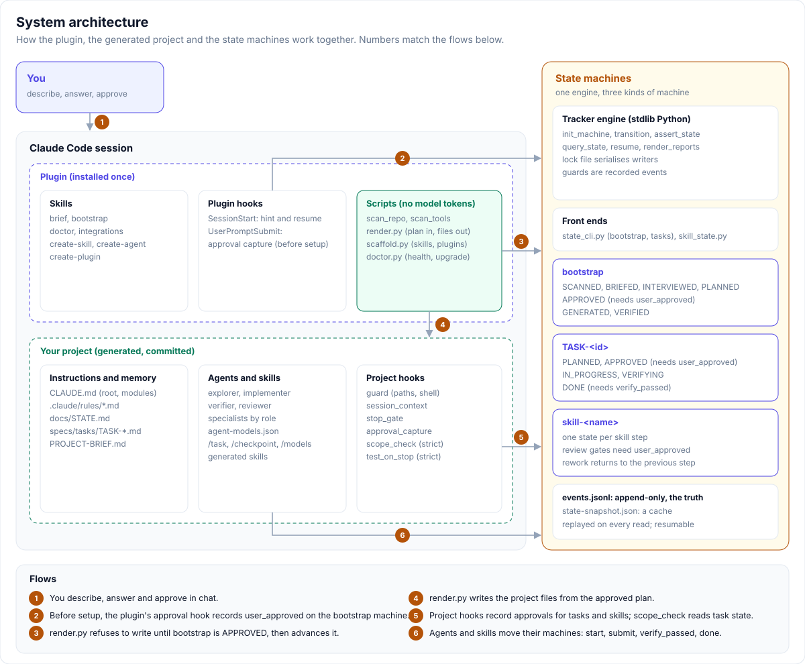

# System design

This document describes how Claude Project Setup is built: its components, data model, state machines, main flows, trust boundaries, failure handling and design decisions. For day-to-day use, see the [Setup guide](setup-guide.md) and the [User guide](user-guide.md).

## 1. Purpose and scope

**Purpose.** Turn a plain-language project description, or an existing repository, into a Claude Code setup that is accurate, guarded, cheap to run and resilient to lost context.

**Goals**
- Nothing is written to a project or installed until the user approves an exact plan.
- Rules that must always hold are enforced by scripts and hooks, not by prompt text alone.
- Work survives `/clear`, compaction, usage limits and new sessions.
- The same plan always produces the same files.
- A set-up project works for teammates without the plugin.
- Repeated work (scanning, rendering, checking) costs no model tokens.

**Non-goals**
- Writing application code beyond what official scaffold generators produce.
- Generating CI pipelines.
- Defending against an agent that deliberately sets out to bypass its own hooks (see section 7).

## 2. Components

| Layer | Component | Location | Responsibility |
|---|---|---|---|
| Plugin | Skills | `plugins/claude-project-setup/skills/` | `brief`, `bootstrap`, `doctor`, `integrations`, `create-skill`, `create-agent`, `create-plugin`: guide Claude through each workflow |
| Plugin | Scripts | `plugins/claude-project-setup/scripts/` | `scan_repo.py`, `scan_tools.py`, `render.py`, `scaffold.py`, `doctor.py`, `hint.py`: all deterministic, standard-library Python |
| Plugin | Plugin hooks | `plugins/claude-project-setup/hooks/hooks.json` | `SessionStart`: hint or resume message. `UserPromptSubmit`: approval capture before setup |
| Plugin | Templates | `plugins/claude-project-setup/templates/` | Every file `render.py` and `scaffold.py` can write |
| Plugin | Tracker | `plugins/claude-project-setup/tracker/` | State machine engine with its own evals |
| Plugin | Catalog | `plugins/claude-project-setup/catalog/integrations.json` | Capabilities, MCP server configurations, known plugins |
| Project | Instructions | `CLAUDE.md`, `<module>/CLAUDE.md`, `.claude/rules/` | Rules loaded by Claude Code, scoped by folder or path |
| Project | Memory | `docs/STATE.md`, `specs/tasks/`, `PROJECT-BRIEF.md` | Current state, approved task specs, setup decisions |
| Project | Agents | `.claude/agents/`, `.claude/agent-models.json` | Subagents and the model policy that tunes them |
| Project | Hooks | `.claude/hooks/`, registered in `.claude/settings.json` | Guardrails, context injection, approvals, scope, tests |
| Project | State | `.claude/state-machine/` | `state_cli.py`, tracker copy, task definition, event logs |
| Project | Manifest | `.claude/setup-manifest.json` | The approved plan and a hash of every generated file |

## 3. Data model

| Artifact | Owner | Format | Notes |
|---|---|---|---|
| `PROJECT-BRIEF.md` | User | Markdown sections | Goal, requirements, project type, stack, risks, protected areas, level, integrations, outputs, decisions |
| Setup plan | Claude, approved by the user | JSON in the temp folder | Schema: [plan.md](../plugins/claude-project-setup/skills/bootstrap/references/plan.md). Never stored in the project except inside the manifest |
| `setup-manifest.json` | `render.py` | `{generator, version, plan, files: {path: {template, sha256}}}` | Lets upgrades tell unedited generated files from edited ones |
| `agent-models.json` | User (seeded once) | `{profile, overrides, escalation, profiles}` | Validated before any write; see [Subagents](subagents.md) |
| Machine definition | Plugin or generator | `{initial, transitions[{from, on, to, guard?, guardScope?}], stateDescriptions?}` | `task.json`, `bootstrap.json`, a skill's `machine.json` |
| `events.jsonl` | Tracker | One JSON object per line: `{seq, ts, type, on, from?, to?, data}` | `type` is `transition`, `event` or `reset`. Append-only. **The source of truth** |
| `state-snapshot.json` | Tracker | `{current_state, seq, updated_at}` | A cache. Every read replays the event log instead |

**File classes in `render.py`**

| Class | Examples | Rule |
|---|---|---|
| Owned | agents, hooks, rules, skills, `CLAUDE.md` | Create if absent; upgrade only when the file still matches its recorded hash; otherwise keep and show the diff |
| Seed | `docs/STATE.md`, `docs/ARCHITECTURE.md`, `.claude/agent-models.json` | Created once; the user's from then on |
| Merged | `.claude/settings.json`, `.mcp.json`, `.gitignore`, `.env.example` | Union merge; the user's existing entries always win |

## 4. State machines

One engine runs three kinds of machine. All of them store state in `.claude/state-machine/.state-machine/<id>/` inside the project.

| Machine | Id | States | Guards |
|---|---|---|---|
| Bootstrap | `bootstrap` | SCANNED, BRIEFED, INTERVIEWED, PLANNED, APPROVED, GENERATED, VERIFIED | `user_approved` since entering PLANNED |
| Task | `TASK-<n>-<slug>` | PLANNED, APPROVED, IN_PROGRESS, VERIFYING, DONE | `user_approved` since entering PLANNED; `verify_passed` since entering VERIFYING |
| Skill run | `skill-<name>` | One state per skill step, then DONE | `user_approved` at each review gate, since entering the gate |

**Engine guarantees**
- A transition is accepted only if the definition declares it from the current state.
- A guard is satisfied only by a recorded event with that name. With `since_entry`, the event must come after the machine last entered the source state, so an old approval never unlocks a later attempt.
- Every command replays `events.jsonl`. A missing snapshot, a stale snapshot or a half-written last line cannot change the outcome.
- Writers are serialised by a lock file. A lock older than 30 seconds is treated as abandoned and broken.
- Machine ids are validated, so they cannot point outside the state directory.

Exit codes: `0` success, `1` bad input, `2` locked, `3` illegal transition, `4` guard unmet, `5` precondition failed, `6` refused (an attempt to record `user_approved` directly).

## 5. Main flows

**Setup (bootstrap)**
1. `brief` scans the repository and drafts `PROJECT-BRIEF.md` from the user's own words. After the user consents, it creates the bootstrap machine and moves it to BRIEFED.
2. `bootstrap` inventories tools (`scan_tools.py`), runs the interview and records the answers in the brief (INTERVIEWED).
3. Claude writes the plan. `render.py --dry-run` lists every file it would create, merge or skip (PLANNED).
4. The user replies "approved". The approval hook records `user_approved` from that message, and Claude moves the machine to APPROVED.
5. `render.py` checks that the machine is APPROVED, writes the files and the manifest, and moves the machine to GENERATED.
6. The project's self-test and `doctor.py` run. On success the machine moves to VERIFIED; on failure it returns to APPROVED.

**Task**
1. `/task` writes `specs/tasks/TASK-<n>-<slug>.md` and creates a task machine (PLANNED).
2. The user replies `approve TASK-<n>`. The hook records the approval, and `/task` moves the machine to APPROVED.
3. The implementer moves the machine to IN_PROGRESS. At the strict level, `scope_check` now limits edits to the task's Allowed files.
4. When the acceptance commands pass, the implementer moves the machine to VERIFYING.
5. The verifier runs the commands. On PASS it records `verify_passed` and moves the machine to DONE; on FAIL it moves the machine back to IN_PROGRESS.

**Generated skill run**: `start`, then `begin` and `done` for each step. At a review gate, `done` waits for the user's approval, and `rework` returns to the previous step.

**Upgrade**: `render.py` without `--plan` re-renders from the manifest's plan, using the project's own model policy. Unedited files are upgraded, edited files are kept with a diff, seed files are left alone and merged files gain only missing entries.

## 6. Context and token design

- `CLAUDE.md` holds at most 100 lines; module files at most 40; `docs/STATE.md` at most 60. `doctor.py` checks all three limits.
- Module `CLAUDE.md` files and path-scoped rules load only when Claude works in the matching folder or files.
- `session_context.py` re-injects `docs/STATE.md` and git status at start, resume, `/clear` and compaction.
- Scanning, rendering, checks and state transitions run as scripts, so they cost no model tokens.
- Read-only agents run on haiku with `omitClaudeMd`, and every agent returns a short, fixed reply format.

## 7. Trust boundaries and security model

| Decision | Made by | Enforced by |
|---|---|---|
| Whether to write the setup | User | `render.py` refuses unless bootstrap is APPROVED |
| Approval of a plan, task or review gate | User's own message | `approval_capture.py`; `state_cli.py` and `skill_state.py` refuse to record `user_approved`; `guard.py` denies shell commands that contain it |
| Which files may be written | User (`protected.txt`, `write-allow.txt`) | `guard.py` on every Write and Edit |
| Destructive shell commands | Fixed policy | `guard.py` deny list, plus permission rules |
| Secrets | Fixed policy | Read deny rules; `.mcp.json` accepts only `${VAR}` references |
| Which files a task may change (strict) | Approved task spec | `scope_check.py`, reading the task machine |
| Whether a task is done | Verifier output | Tracker guard `verify_passed` |

**Limits.** These controls stop accidental skipping and shortcuts. An agent that deliberately sets out to defeat them, for example by writing files through a route the hooks do not inspect, is out of scope. The approval hook also cannot prove that a human typed a message; it only guarantees that the approval came from the user turn, not from Claude.

## 8. Failure handling

| Failure | Behaviour |
|---|---|
| Invalid plan (missing variable, unknown template, literal secret, bad model policy) | `render.py` exits 2 and writes nothing |
| Setup not approved | `render.py` exits 3 and writes nothing |
| Invalid generator spec, or target file exists | `scaffold.py` exits 2 or 3 and writes nothing |
| Crash between event and snapshot | Next command replays the log; the stale snapshot is ignored |
| Half-written last event line | Ignored with a note; earlier corruption fails cleanly with exit 1 |
| Abandoned lock | Broken automatically after 30 seconds |
| Session ends mid-setup | The next session's start hook names the bootstrap state; `bootstrap` resumes there |
| Fast test command cannot run | `test_on_stop.py` blocks with the reason; `doctor.py` reports FAIL |
| User edited a generated file | Upgrade keeps the file and shows the template diff |

## 9. Design decisions

| Decision | Reason |
|---|---|
| Python standard library only | Runs anywhere Claude Code runs, with nothing to install |
| Plan in, files out | One reviewable artifact; reproducible output; dry run shows the exact result |
| Generated files are committed to the project | Teammates get the same guardrails without the plugin |
| Event log as the source of truth | Crash-safe, auditable and resumable; the snapshot is only a cache |
| Approvals recorded from the user's message | The model cannot approve its own plan by accident |
| One tracker copy per installable unit | Self-contained installs without drift between copies |
| Seed files belong to the user after creation | Upgrades never fight a file the user maintains |
| Cheapest capable model per agent role, with one-step escalation | Lower cost by default, with a defined path to a stronger model |

## 10. Extending

See [Development](development.md#adding-things) for where to add an agent template, a hook, an MCP server or a template variable, and which docs to update with it.

## 11. Testing

- `plugins/claude-project-setup/tests/test_scripts.py`: 28 tests, including the tracker's own 23 evals.
- Every bug fix ships with a regression test, and each regression test was shown to fail without its fix.
- End-to-end runs on real repositories are recorded in [reports](reports/v0.4-phases.md).
- Not yet covered: a live interactive Claude Code session, and Windows.
