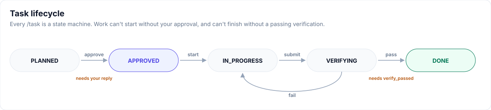

# User guide

## The daily loop

- **One task per session.** When a task is done, run `/checkpoint`, then `/clear`.
- **Plan first.** Any change touching more than one file goes through `/task`.
- **Approve explicitly.** Reply `approved` (or `approve TASK-007`). A hook records it from **your** message, and Claude can't approve for you.
- **Trust output, not claims.** The verifier quotes real command output; "should pass" is never accepted.

## 1. Describe → brief
- Describe the project in chat, or run `/claude-project-setup:brief <description>`.
- Claude drafts `PROJECT-BRIEF.md` **only from what you said**. Anything you didn't say stays empty or `recommend`.
- It asks before creating the file.
- Edit the brief in your editor if you like, then say **go**.

| Section | Fill with |
|---|---|
| Goal | One paragraph: what and for whom |
| Requirements | Numbered, one goal each; each becomes a task |
| Stack preferences | A framework, `recommend`, or `keep current` |
| Risk areas | auth, payments, PII, migrations… (adds specialist agents) |
| Protected areas | Paths Claude must never touch, e.g. `backend/*` |
| Guardrail level | `light` · `standard` · `strict` · `recommend` |
| Tools & integrations | Plugins and MCP servers you want, or `recommend` |
| Outputs location | A folder **outside** the repo for runs and screenshots |

## 2. Bootstrap
- Scans the repo and your installed plugins and MCP servers (scripts, no AI tokens).
- Asks at most **2 rounds × 4 questions**, each with a recommended default.
- Shows a **setup plan**: every file, agent, hook, permission and integration, plus its token cost.
- Generates files only after you approve, then runs the self-test and `doctor`.
- Full step-by-step: [Workflow](workflow.md).

## 3. Work in tasks
- `/task add CSV export to the reports page`
  - It splits mixed requests and asks which goal comes first.
  - It writes `specs/tasks/TASK-NNN-*.md` with **Allowed files**, **Non-goals** and **Acceptance commands**.
- After you approve: implementer → verifier → reviewer.
- Each task has a state machine: `PLANNED → APPROVED → IN_PROGRESS → VERIFYING → DONE`. It can't reach `DONE` until the verifier records a pass.
- At **strict** level, edits outside the Allowed files of the task in progress are blocked by a hook.
- Check where things stand: `python3 .claude/state-machine/state_cli.py status`.

## 4. Keep context
- `docs/STATE.md` (≤ 60 lines) is the project's memory. It's injected at start, resume, `/clear` and compaction.
- The Stop hook sends Claude back once to update `docs/STATE.md` if code changed after it was last updated.
- If a session compacts a second time, `/checkpoint` and start a new session.
- Details: [Context management](context-management.md).

## 5. Maintain
| Need | Run |
|---|---|
| Health check | `/claude-project-setup:doctor` |
| Plugin and MCP cost | `/claude-project-setup:doctor --tools` |
| Refresh generated files after a plugin update | `/claude-project-setup:doctor upgrade` |
| Add or remove plugins and MCP servers | `/claude-project-setup:integrations` |
| Change a guardrail | Edit `.claude/protected.txt` or `.claude/write-allow.txt` |

Next: [Workflow](workflow.md) · [Guardrails](guardrails.md)
